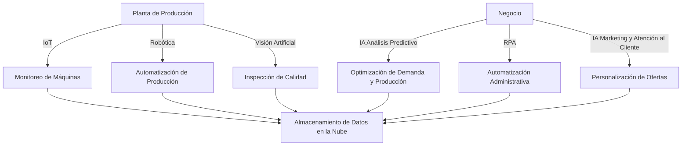

# Proyecto de Transformación Digital con IA para Nestlé

**Empresa**: Nestlé (Multinacional).  

**Sector**: Alimentación y Bebidas.  

**Características**: Nestlé es una de las mayores empresas de alimentos y bebidas a nivel mundial. Se enfoca en la sostenibilidad y la eficiencia de sus procesos de producción.  

**Por qué hemos elegido esta empresa**: Nestlé tiene muchas plantas de producción en todo el mundo que podrían beneficiarse de la digitalización de procesos, desde la gestión de inventarios hasta la producción automatizada y el control de calidad. La IA podría ayudar en la optimización de la cadena de suministro, la predicción de demanda y el análisis de la satisfacción del cliente, lo que sería crucial para la toma de decisiones estratégicas.  

**Miembros del grupo**: Antonio Caro, Rocío Luque, Adrían Díaz, Juan Herrador

---

## 1. Estudio de Conceptos

### **Digitalización en Planta**:
La digitalización en planta se refiere a la automatización y optimización de los procesos de producción. En Nestlé, esto implicaría el uso de tecnologías como el **Internet de las Cosas (IoT)** para supervisar las máquinas de producción en tiempo real, y la **inteligencia artificial (IA)** para predecir fallos y optimizar los tiempos de producción y mantenimiento. Además, la implementación de **robots colaborativos** y **visión artificial** puede mejorar la calidad de los productos y aumentar la velocidad de producción.

### **Digitalización en Negocio**:
Por otro lado, la digitalización en negocio se enfoca en la optimización de las operaciones administrativas. En Nestlé, esto podría incluir el uso de IA para la **gestión de inventarios**, la **optimización de la cadena de suministro**, la **atención al cliente**, y la **toma de decisiones estratégicas**. Las **plataformas de análisis de datos** y los **sistemas ERP (Enterprise Resource Planning)** permitirían integrar la información de todas las áreas, mejorando la toma de decisiones y reduciendo costos operativos.

---

## 2. Selección de Sector y Empresa

- **Empresa**: Nestlé.
- **Características de la empresa**:
  - **Tamaño**: Multinacional, con más de 200,000 empleados en todo el mundo.
  - **Productos**: Alimentos y bebidas, incluyendo marcas icónicas como Nescafé, KitKat, Maggi, entre otras.
  - **Clientes**: Consumidores globales, presentes en más de 190 países.
  - **Sostenibilidad**: Fuerte enfoque en la sostenibilidad y la eficiencia energética.

---

## 3. Tecnologías Aplicables a la Digitalización

### **Tecnologías para la Planta de Producción**:
1. **IoT (Internet of Things)**:  
   Sensores conectados en las fábricas para monitorear las condiciones de las máquinas, temperaturas, niveles de inventario y la calidad del producto en tiempo real. Esto permitirá un mantenimiento predictivo y la optimización de la producción.
   
2. **Robótica y Automatización**:  
   Implementación de robots colaborativos en las líneas de producción, lo que puede aumentar la eficiencia, reducir el margen de error humano y mejorar la seguridad de los trabajadores.
   
3. **Visión Artificial**:  
   Utilización de cámaras y algoritmos de IA para inspeccionar productos durante la producción y asegurar que cumplan con los estándares de calidad. Esto puede minimizar defectos y mejorar la consistencia del producto.

### **Tecnologías para el Negocio**:
1. **Análisis Predictivo con IA**:  
   Herramientas basadas en IA que analicen patrones de consumo, comportamientos de compra y tendencias del mercado. Esto permitirá a Nestlé anticipar la demanda y ajustar su producción y distribución.
   
2. **Automatización de Procesos con RPA (Robotic Process Automation)**:  
   Automatización de tareas repetitivas como la facturación, gestión de pagos, la planificación de inventarios y la gestión de pedidos a través de robots de software.
   
3. **IA en Marketing y Atención al Cliente**:  
   Implementación de chatbots para mejorar la atención al cliente, así como el uso de algoritmos de IA para personalizar ofertas y promociones basadas en el comportamiento del consumidor.

---

## 4. Diagrama de Estructura IT y OT de Nestlé (con Mermaid)

A continuación, se presenta un diagrama de la estructura IT (Tecnologías de la Información) y OT (Tecnologías Operacionales) de Nestlé, destacando cómo las tecnologías de IA afectan a los procesos clave tanto en la planta como en las operaciones del negocio.

---

## 5. Propuesta de Transformación Digital para Nestlé

### **Planta de Producción**:
La digitalización en la planta de Nestlé tiene como objetivo optimizar los procesos de fabricación, reducir tiempos de inactividad y asegurar la calidad del producto. Las tecnologías clave incluyen:

- **IoT**: Sensores inteligentes conectados a las máquinas permitirán una monitorización constante de las condiciones de operación y el estado de los equipos. Esto ayudará a prever fallos antes de que ocurran, evitando paradas de producción y mejorando la eficiencia operativa.
  
- **Robótica y Automatización**: La implementación de robots colaborativos permitirá a los operarios centrarse en tareas más complejas mientras los robots se encargan de tareas repetitivas, como el embalaje y el manejo de materiales. Esto optimizará la producción y reducirá el error humano.

- **Visión Artificial**: Con sistemas de visión artificial basados en IA, Nestlé podrá inspeccionar de forma automática el producto final para detectar defectos en calidad. Esto asegurará que los productos que llegan al mercado estén dentro de los estándares de calidad.

### **Negocio (Operaciones Administrativas)**:
La transformación digital en las operaciones de negocio de Nestlé tiene como objetivo mejorar la toma de decisiones estratégicas y la eficiencia administrativa. Las tecnologías clave incluyen:

- **Análisis Predictivo**: El uso de IA para analizar datos de ventas y tendencias de consumo permitirá a Nestlé ajustar la producción de acuerdo con la demanda anticipada, evitando tanto los desabastecimientos como el exceso de inventario.
  
- **Automatización de Procesos Administrativos (RPA)**: El uso de RPA para tareas como la facturación, gestión de pagos y la planificación de inventarios automatizará muchas de las tareas repetitivas, reduciendo errores humanos y liberando tiempo para tareas más estratégicas.

- **IA en Marketing y Atención al Cliente**: La implementación de chatbots y sistemas de recomendación basados en IA permitirá a Nestlé ofrecer una atención al cliente más rápida y personalizada. Además, los algoritmos de IA ayudarán a personalizar las ofertas, maximizando las ventas y mejorando la experiencia del consumidor.

---

## 6. Reflexión sobre el Impacto de la IA en Nestlé

La implementación de IA en Nestlé no solo mejorará la eficiencia operativa y la calidad del producto, sino que también tendrá un impacto significativo en la toma de decisiones estratégicas. El uso de análisis predictivo permitirá una mejor planificación de la producción y distribución, mientras que la automatización de procesos administrativos reducirá los costos operativos y permitirá que el personal se enfoque en tareas de mayor valor.

Además, la personalización de ofertas y la mejora en la atención al cliente a través de IA consolidará la relación de Nestlé con los consumidores, asegurando su competitividad en un mercado cada vez más exigente.

En el futuro, la IA permitirá a Nestlé adelantarse a las tendencias del mercado, anticipar necesidades de los consumidores y optimizar aún más sus procesos de producción. La digitalización de extremo a extremo facilitará la sostenibilidad, una mayor personalización de productos y un mejor posicionamiento en la industria alimentaria.
